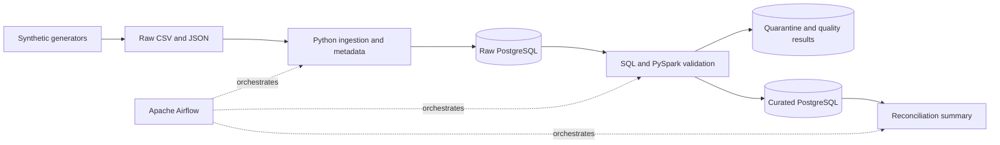

# Banking Data Reliability Lab

A portfolio data-engineering project that demonstrates how to detect, contain,
explain, and recover from data failures before unreliable banking data reaches
downstream users.

> **Status:** Repository foundation. The first runnable pipeline has not been
> implemented yet; delivery is tracked through milestone Issues.

## Why this project exists

Operational and analytical outputs become unreliable when customer, account,
transaction, and reference data arrive late, contain duplicates, use
inconsistent identifiers, or fail reconciliation. This lab will build a small,
reproducible platform that makes those failures visible and recoverable.

All data will be synthetic. This repository will not contain employer or client
code, real customer data, proprietary schemas, or confidential business logic.

## What the first release will prove

- Generate deterministic customer, account, transaction, institution, and
  service-mapping data.
- Ingest batch files and event-style records into an immutable raw layer.
- Validate schemas, required values, uniqueness, and referential integrity.
- Quarantine invalid records with machine-readable reason codes.
- Publish curated tables only after blocking checks pass.
- Reconcile accepted transaction counts and control totals.
- Demonstrate an idempotent rerun and a corrected-data recovery.
- Provide reproducible setup, automated tests, and operational evidence.

## Planned architecture



Small control and metadata workloads will remain in Python and SQL. PySpark will
be used only where distributed-processing behaviour is genuinely demonstrated.

## Planned stack

- Python, SQL, PySpark, PostgreSQL
- Apache Airflow for orchestration and recovery
- Docker Compose for a reproducible local environment
- Pytest for unit, contract, integration, and representative end-to-end tests
- GitHub Actions for continuous integration

## Success criteria

- Detect every seeded blocking defect in the demonstration suite.
- Produce no duplicate curated records after identical reruns.
- Reconcile clean fixture counts and control totals exactly.
- Route every rejected record to quarantine with a traceable reason.
- Complete a clean local demonstration in 15 minutes or less.
- Recover from a late file and a corrected-data backfill.
- Pass all automated tests in CI.

## Repository map

```text
.
├── .github/              # Issue forms and repository collaboration settings
├── docs/issues/          # Reviewable drafts for planned GitHub milestone Issues
├── src/                  # Application package (implemented milestone by milestone)
├── tests/                # Automated test suites
├── .env.example          # Safe local configuration template
├── CONTRIBUTING.md       # Issue-first contribution workflow
└── pyproject.toml        # Python project and dependency configuration
```

## Local setup

The repository currently contains the professional foundation only. Once the
first implementation milestone lands, setup will follow this shape:

```bash
cp .env.example .env
python -m venv .venv
source .venv/bin/activate
python -m pip install --upgrade pip
python -m pip install -e ".[dev]"
```

Runnable commands will be added only when their implementation and tests exist.

## Delivery plan

Work is intentionally issue-driven. Major milestones and their acceptance
criteria are documented in [`docs/issues`](docs/issues/) and will be created as
GitHub Issues before implementation begins.

## Scope boundaries

This is an educational portfolio project, not a production banking platform.
It does not execute payments, service accounts, make fraud or credit decisions,
or claim regulatory compliance. Kafka, Kubernetes, machine learning, LLMs, and
multi-cloud deployment are excluded from the first release.

## Contributing and licence

See [CONTRIBUTING.md](CONTRIBUTING.md) before proposing a change. This project is
licensed under the [MIT License](LICENSE).
